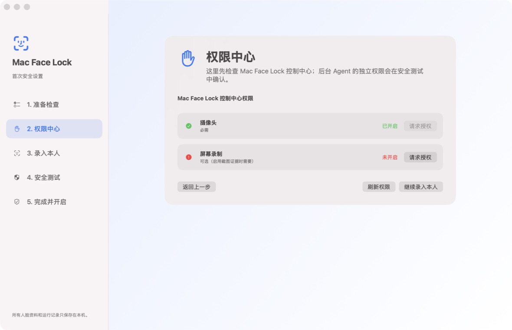
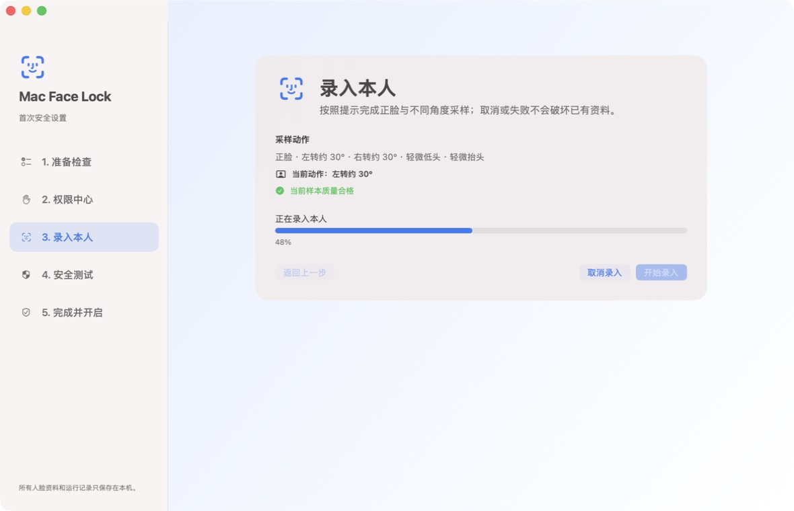

# Mac Face Lock

Mac Face Lock 是一款默认在本机处理、运行时默认离线的 macOS 人脸锁屏辅助工具。项目提供自包含桌面发行包的构建能力，也支持从源码自行构建。项目源码采用 [MIT License](LICENSE)。

> 安全提醒：当前人脸比对没有活体检测，照片、视频或其他重放方式可能绕过识别。Mac Face Lock 不能替代 macOS 登录密码、Touch ID、FileVault、系统锁屏策略、MDM 或物理访问控制，不应用于高安全场景。

## 普通客户：下载安装

正式面向普通客户的构建只会发布在项目的 **GitHub Releases**，文件名为 `Mac-Face-Lock-0.2.0-beta-arm64.zip` 和同名 `.sha256`。如果 Releases 页面没有发行版，表示项目**尚未公开客户构建**，请不要把 Actions 构件、本地构建或第三方转载当作正式下载。发行包自带运行组件，**无需 Codex、Python、Xcode、终端或源码仓库**。

1. 在 Finder 中解压 ZIP，把 `Mac Face Lock.app` 拖入“应用程序”。
2. 可按 [普通客户安装指南](docs/customer-installation.md) 校验 SHA-256。
3. 因当前公开 Beta 使用临时签名且没有 Apple 公证，首次启动请在 Finder 中对应用**右键**，选择“打开”，再确认一次。
4. 按首次设置依次完成“准备检查”“权限中心”“录入本人”和“权限确认”，最后在“完成并开启”中主动开启保护。

发行包中的控制中心与内嵌后台运行时使用同一个 `Mac Face Lock` 代码签名身份。升级
自本次修复之前的 Beta 后，macOS 可能仍保留旧版本的隐私授权记录；请在三个系统
设置页面中对当前的 **Mac Face Lock** 各重新确认一次，之后同一发行身份的升级不
会再生成第二个 Agent 权限项。

当前发行版支持 Apple Silicon Mac 与 macOS 12 或更高版本。首次设置会引导开启：

- 控制中心的摄像头权限；
- Mac Face Lock 应用的摄像头、输入监控和辅助功能权限；
- 仅在用户启用锁屏前截图时才需要的屏幕录制权限。

系统更新、移动应用或重置隐私权限后，macOS 可能要求再次授权。应用会显示修复入口；重新授权后回到权限中心或权限确认页刷新状态即可。升级自早期源码 Beta 时，不导入旧模板，必须**重新录入本人**并确认权限状态。

### 首次设置界面

权限中心会逐项显示真实授权状态：



录入本人完成后，权限确认页会重新读取统一 Mac Face Lock 应用身份的摄像头、输入监控、辅助功能和后台服务状态。它只显示实时状态并提供系统设置入口，不执行额外的诊断或本人验证。

录入本人要求完成正脸、左转、右转、轻微低头和轻微抬头，任一动作缺失都不会提前完成：



更多 Finder 安装、校验、权限修复和卸载说明见 [普通客户安装指南](docs/customer-installation.md)。

## 安全与隐私边界

- 人脸模板、验证、状态、活动记录、设置和可选证据默认在本机处理；正常运行默认离线。
- 摄像头不可用或读取失败时使用 **fail-open**：保持 Mac 解锁并显示警告，避免设备故障造成误锁。这不是高安全策略。
- 当前版本**没有活体检测**，可能被照片或视频重放绕过。
- 通知默认关闭；只有用户显式配置自定义脚本后，事件才可能离开本机。
- 屏幕截图默认关闭；摄像头证据默认只保存在本机。
- “暂停保护”会停止布防、验证和锁屏，但界面、活动记录及已配置的通知链路仍可运行。

完整威胁边界和私密漏洞报告状态见 [SECURITY.md](SECURITY.md)。

## 工作方式

发行版只安装一个 `Mac Face Lock.app`。后台运行组件和控制中心都内置在这个应用包中，权限只需要授予统一的 Mac Face Lock 应用身份，不需要单独安装、打开或授权另一个 Agent 应用。

后台运行组件负责输入监听、人脸验证、状态记录与锁屏；同一个 Mac Face Lock 应用还负责首次设置、状态展示和暂停/恢复。

默认保护流程：

```text
正常使用，不检查摄像头
        ↓
连续空闲达到阈值
        ↓
进入保护态，但不立即锁屏
        ↓
出现鼠标或键盘输入
        ↓
摄像头进行短时本地验证
        ↓
本人：放行并退出保护态
非本人或无法确认：锁屏
摄像头不可用：保持解锁并显示警告
```

锁屏不会让系统睡眠，也不会停止网络或后台服务。默认空闲 60 秒后布防；本人命中至少 2 次放行；陌生人命中至少 3 次锁屏；锁屏后与摄像头错误冷却时间均不少于 300 秒。

## 本地数据与卸载

发行版数据保存在用户的 Application Support 目录；源码开发模式的数据位于仓库的 `data/` 与 `logs/`。主要内容包括本人模板、状态、活动记录、界面偏好、日志及可选证据。

普通**卸载**应先打开“设置 → 服务诊断与修复”，点击“卸载后台服务并保留数据”并确认成功，再退出应用并把它移到废纸篓。该操作停止服务并默认**保留数据**，以后重装可继续使用。只把应用移到废纸篓不能可靠停止已注册的后台服务。若要**彻底删除**，请先确认不再需要本人模板、活动记录和证据，再按 [普通客户安装指南](docs/customer-installation.md#卸载与删除数据) 删除应用支持数据。此操作不可恢复。

## 从源码测试版转到发行版

如果发行版检测到本项目已知的源码测试版，会在首次设置中要求确认一次不可恢复的清理：
停止并移除旧 Agent 与旧状态服务，删除源码目录中的 config/config.json、data/、logs/
和已构建的 Mac Face Lock 应用。源码、Git 历史、文档、脚本与 .venv 保留。
旧人脸模板和设置不会导入；清理完成后必须重新授权、录入本人并确认权限状态。
卸载发行版不会恢复旧服务或旧数据。

如旧版结构不完整，应用不会猜测或继续删除，而会提供仅含结构布尔值的诊断摘要与处理指南。

## 源码开发

源码发布线仍是 **源码 Beta**，适用于开发、审计和贡献。需要 Apple Silicon Mac、macOS 12 或更高版本、Python 3.9 或更高版本，以及 Xcode Command Line Tools。

源码开发模式的构建脚本会额外生成 `Mac Face Lock Agent.app` 供开发和审计使用；它不属于普通客户下载的发行包。普通客户发行包仍只有一个 `Mac Face Lock.app` 应用身份。

```bash
git clone <repository-url>
cd mac-face-lock-agent
scripts/bootstrap.sh
scripts/enroll-owner.sh
scripts/install-launchagent.sh
```

`scripts/bootstrap.sh` 会拒绝低于 Python 3.9 的解释器，创建 `.venv`，并从 `requirements-lock.txt` 安装固定版本依赖。该锁文件目前不包含 hashes：它固定解析后的版本，但不提供下载包文件的哈希完整性校验。首次安装依赖需要访问 pip 包源。

本人人脸模板保存在 `data/owner_face.npy`，不得提交到 Git。安装脚本必须从主仓库目录运行，不能从 linked worktree 迁移正在运行的服务。

构建源码应用：

```bash
scripts/build-app.sh
scripts/build-status-app.sh
```

使用锁定的 Python 3.11 与 PyInstaller 6.21.0 构建可分发 ZIP：

```bash
scripts/build-release.sh
```

需要在本机开发和升级时保留摄像头、输入监控、辅助功能等 TCC 权限，应使用钥匙串中的稳定 Apple Development 或 Developer ID 签名身份：

```bash
MAC_FACE_LOCK_SIGNING_IDENTITY="Apple Development: <name> (<team-id>)" \
  scripts/build-release.sh
```

未设置该变量时构建会回退到 ad-hoc 签名，适合无证书的 CI 构件检查，但 macOS 无法可靠地把不同 ad-hoc 构建识别为同一应用；替换应用后可能必须重新授权。公开客户构建必须使用适合分发的稳定签名和公证，不能把 ad-hoc CI 构件当作正式发行版。

输出为 `dist/release/Mac-Face-Lock-0.2.0-beta-arm64.zip` 及其 SHA-256 文件。GitHub 的手动工作流只生成可检查的构件，不自动创建 Release。

## 源码运行与卸载

查看服务、状态和最近日志：

```bash
scripts/status.sh
```

运行诊断：

```bash
scripts/run-agent.sh
scripts/camera-diagnostic.sh
```

仅在明确测试锁屏行为时运行：

```bash
scripts/lock-now.sh
```

卸载源码模式的两个 LaunchAgent：

```bash
scripts/uninstall-launchagent.sh
```

源码模式卸载不会删除 `data/`、`logs/`、本人模板、活动记录、界面偏好或证据。

## 完整测试

先通过 `scripts/bootstrap.sh` 创建 `.venv`，再从项目根目录运行：

```bash
.venv/bin/python -m unittest discover -s tests -p 'test_*.py' -v

xcrun swiftc -parse-as-library \
  src/app/AppVersionDisplay.swift \
  tests/swift/AppVersionDisplayTests.swift \
  -o /tmp/mac-face-lock-version-display-tests
/tmp/mac-face-lock-version-display-tests

xcrun swiftc -parse-as-library \
  src/app/Models.swift src/app/SetupModels.swift \
  src/app/LocalJSONStore.swift \
  tests/swift/LocalStoreSmokeTests.swift \
  -o /tmp/mac-face-lock-store-tests
/tmp/mac-face-lock-store-tests

xcrun swiftc -parse-as-library -DTESTING \
  src/app/ProjectLocator.swift tests/swift/ProjectLocatorTests.swift \
  -o /tmp/mac-face-lock-project-locator-tests
/tmp/mac-face-lock-project-locator-tests

xcrun swiftc -parse-as-library -DTESTING \
  src/agent-launcher/main.swift tests/swift/AgentLauncherPathTests.swift \
  -o /tmp/mac-face-lock-agent-launcher-tests
/tmp/mac-face-lock-agent-launcher-tests

xcrun swiftc -parse-as-library \
  -target arm64-apple-macosx12.0 \
  -strict-concurrency=complete -warn-concurrency -warnings-as-errors \
  src/app/UIEventTraceRecorder.swift \
  tests/swift/UIEventTraceRecorderTests.swift \
  -o /tmp/mac-face-lock-ui-event-trace-tests
/tmp/mac-face-lock-ui-event-trace-tests

xcrun swiftc -parse-as-library \
  -target arm64-apple-macosx12.0 \
  -strict-concurrency=complete -warn-concurrency -warnings-as-errors \
  src/app/UIEventTraceRecorder.swift src/app/LocalMouseEventMonitor.swift \
  tests/swift/LocalMouseEventMonitorTests.swift \
  -framework AppKit \
  -o /tmp/mac-face-lock-mouse-monitor-tests
/tmp/mac-face-lock-mouse-monitor-tests

xcrun swiftc -parse-as-library -typecheck \
  src/app/*.swift -framework AppKit -framework SwiftUI \
  -framework AVFoundation -framework ApplicationServices \
  -framework CoreGraphics

plutil -lint src/app/Info.plist
plutil -lint \
  launchd/com.wuyi.mac-face-lock-agent.plist \
  launchd/com.wuyi.mac-face-lock-release.plist \
  launchd/com.wuyi.mac-face-lock-status.plist

scripts/build-app.sh
scripts/build-status-app.sh
codesign --verify --deep --strict "dist/Mac Face Lock Agent.app"
codesign --verify --deep --strict "dist/Mac Face Lock.app"
```

贡献说明见 [CONTRIBUTING.md](CONTRIBUTING.md)，版本变化见 [CHANGELOG.md](CHANGELOG.md)，直接和发行包依赖许可见 [THIRD_PARTY_NOTICES.md](THIRD_PARTY_NOTICES.md)。
