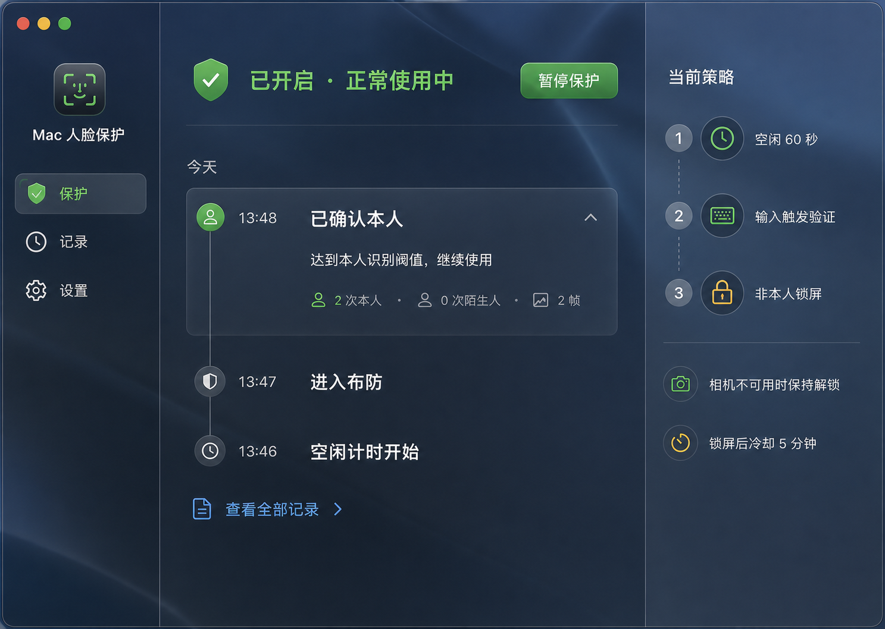
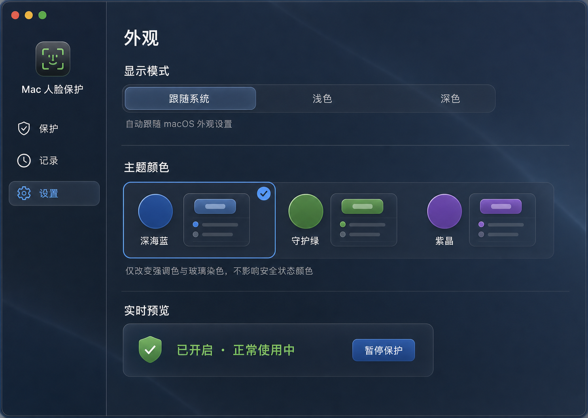

# Mac Face Lock

Mac Face Lock 是一套默认在本机处理、运行时默认离线的 macOS 人脸锁屏辅助工具。当前发布是 **源码 Beta**：仓库提供源码和本地构建脚本，不提供 Developer ID 签名或 Apple 公证的二进制安装包；用户显式启用的外部通知脚本是离线默认的例外。

公开版本为 `0.1.0-beta`，对应 Git tag `v0.1.0-beta`；两个应用的营销版本统一为 `0.1.0`、build 为 `1`。项目源码采用 [MIT License](LICENSE)。

> 安全提醒：当前人脸比对没有活体检测，照片、视频或其他重放方式可能绕过识别。Mac Face Lock 不能替代 macOS 登录密码、Touch ID、FileVault、系统锁屏策略、MDM 或物理访问控制，不应用于高安全场景。

## 桌面端界面预览

### 保护概览



### 外观设置



## 系统要求

- Apple Silicon Mac
- macOS 12 或更高版本
- Python 3.9 或更高版本
- Xcode Command Line Tools（用于本地编译两个 Swift 启动应用）
- 摄像头、输入监控和辅助功能权限
- 仅当启用锁屏前屏幕截图时需要屏幕录制权限

所有系统权限都必须由用户在“系统设置 → 隐私与安全性”中确认；脚本不会绕过系统授权。

## 安装

在终端运行：

```bash
git clone <repository-url>
cd mac-face-lock-agent
scripts/bootstrap.sh
scripts/enroll-owner.sh
scripts/install-launchagent.sh
```

`scripts/bootstrap.sh` 会拒绝低于 Python 3.9 的解释器，创建 `.venv`，并从 `requirements-lock.txt` 安装固定版本依赖。该锁文件目前不包含 hashes：它固定解析后的版本，但不提供下载包文件的哈希完整性校验。首次安装依赖需要访问 pip 包源。

录入本人时，请在摄像头前缓慢覆盖正脸、左右约 30 度、轻微低头和抬头。模板保存在 `data/owner_face.npy`，不要提交到 Git。

安装脚本必须从主仓库目录运行，不能从 linked worktree 直接迁移正在运行的服务。脚本会构建并临时签名两个应用、验证签名，再事务式更新两个用户 LaunchAgent。

## 工作方式

系统由两个常驻进程组成：

- `Mac Face Lock Agent.app`：唯一的 Python 安全执行器，负责输入监听、人脸验证、状态记录与锁屏。
- `Mac Face Lock.app`：统一的原生菜单栏与桌面控制中心，只展示状态并发送暂停/恢复指令，不执行人脸识别或锁屏。

默认 `presence_guard` 流程：

```text
正常使用，不检查摄像头
        ↓
连续空闲达到阈值
        ↓
进入保护态，但不立即锁屏
        ↓
出现鼠标或键盘输入
        ↓
摄像头进行短时本地验证
        ↓
本人：放行并退出保护态
非本人或无法确认：锁屏
摄像头不可用：保持解锁并显示警告
```

锁屏不会让系统睡眠，也不会停止网络或后台服务。关键默认值位于 `config/config.json`：空闲 60 秒后布防；本人命中至少 2 次放行；陌生人命中至少 3 次锁屏；锁屏后与摄像头错误冷却时间均不少于 300 秒。

## 隐私、安全与通知

- 正常运行默认离线：人脸模板、验证、状态、活动记录和设置都在本机处理，不调用云端识别服务。
- 摄像头不可用时保持 Mac 解锁。`lock_on_camera_error` 默认且必须保持为 `false`；摄像头故障不会被当成陌生人。
- 通知默认关闭：`event_notify_on_lock` 为 `false`，`event_notify_script` 为空。项目只提供可选的本地通知脚本接口，不内置外部发送服务。
- 显式启用通知接口后，自定义脚本可能把事件或证据发送到外部系统；该脚本的目的地、存储和重试策略由使用者负责审查。
- 摄像头证据默认保存在本机，屏幕截图默认关闭。
- “暂停保护”会停止布防、验证和锁屏，但 Agent、界面、活动记录和已配置的通知链路仍可运行。

更完整的威胁边界和私密漏洞报告方式见 [SECURITY.md](SECURITY.md)。

## 统一菜单栏与控制中心

安装后，菜单栏会出现 `脸锁:…` 状态入口。可以直接查看状态、暂停或恢复保护、刷新状态、打开证据目录、查看 Agent 日志，以及打开控制中心。

控制中心包含“保护”“记录”“设置”三个页面。重复打开只会唤起同一个窗口；暂停后，菜单栏、保护页和 `data/state.json` 都会显示明确的暂停状态。

界面支持跟随系统、浅色或深色外观，以及深海蓝、守护绿、紫晶三种强调色。偏好保存在 `data/ui-preferences.json`；主题色不会覆盖安全、警告和错误的语义颜色。

## 本地数据

| 路径 | 用途 |
| --- | --- |
| `data/owner_face.npy` | 本人人脸模板 |
| `data/state.json` | Agent 当前状态 |
| `data/control.json` | 暂停/恢复控制状态 |
| `data/activity.jsonl` | 控制中心活动时间线 |
| `data/ui-preferences.json` | 外观和主题偏好 |
| `data/evidence/` | 可选的锁屏前本地证据 |
| `logs/agent.log` | Agent 运行日志 |

`data/activity.jsonl` 是本机 JSON Lines 文件，仅供统一界面读取。卸载服务不会删除 `data/`、`logs/`、本人模板、活动记录、界面偏好或证据；重新安装后可继续使用这些数据。需要彻底删除时，请在确认备份需求后手动移除。

## 构建、状态与卸载

单独构建两个应用：

```bash
scripts/build-app.sh
scripts/build-status-app.sh
```

产物为：

```text
dist/Mac Face Lock Agent.app
dist/Mac Face Lock.app
```

查看两个服务、当前状态和最近日志：

```bash
scripts/status.sh
```

卸载两个 LaunchAgent：

```bash
scripts/uninstall-launchagent.sh
```

卸载只停止服务并移除 `~/Library/LaunchAgents/com.wuyi.mac-face-lock-agent.plist` 和 `~/Library/LaunchAgents/com.wuyi.mac-face-lock-status.plist`，不会删除上述本地数据。

## 诊断

```bash
scripts/run-agent.sh
scripts/camera-diagnostic.sh
```

仅在明确测试锁屏行为时运行：

```bash
scripts/lock-now.sh
```

## 完整测试

先通过 `scripts/bootstrap.sh` 创建 `.venv`，再从项目根目录运行：

```bash
.venv/bin/python -m unittest discover -s tests -p 'test_*.py' -v

xcrun swiftc -parse-as-library \
  src/app/Models.swift src/app/LocalJSONStore.swift \
  tests/swift/LocalStoreSmokeTests.swift \
  -o /tmp/mac-face-lock-store-tests
/tmp/mac-face-lock-store-tests

xcrun swiftc -parse-as-library -DTESTING \
  src/app/ProjectLocator.swift tests/swift/ProjectLocatorTests.swift \
  -o /tmp/mac-face-lock-project-locator-tests
/tmp/mac-face-lock-project-locator-tests

xcrun swiftc -parse-as-library -DTESTING \
  src/agent-launcher/main.swift tests/swift/AgentLauncherPathTests.swift \
  -o /tmp/mac-face-lock-agent-launcher-tests
/tmp/mac-face-lock-agent-launcher-tests

xcrun swiftc -parse-as-library -typecheck \
  src/app/*.swift -framework AppKit -framework SwiftUI

plutil -lint src/app/Info.plist
plutil -lint \
  launchd/com.wuyi.mac-face-lock-agent.plist \
  launchd/com.wuyi.mac-face-lock-status.plist

scripts/build-app.sh
scripts/build-status-app.sh
codesign --verify --deep --strict "dist/Mac Face Lock Agent.app"
codesign --verify --deep --strict "dist/Mac Face Lock.app"
```

贡献说明见 [CONTRIBUTING.md](CONTRIBUTING.md)，版本变化见 [CHANGELOG.md](CHANGELOG.md)，直接依赖许可见 [THIRD_PARTY_NOTICES.md](THIRD_PARTY_NOTICES.md)。
