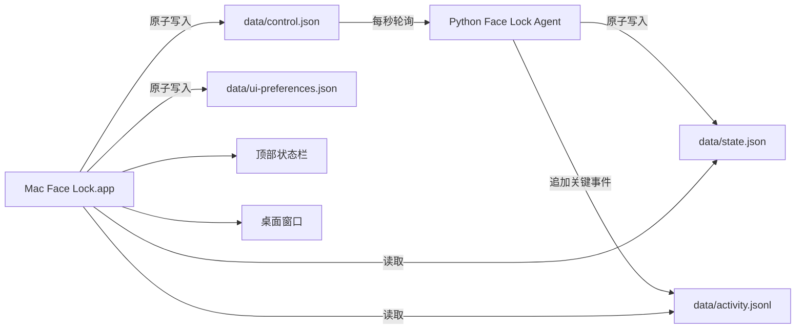

# Mac Face Lock 融合桌面端设计规格

日期：2026-07-14
状态：视觉方向与融合架构已获用户确认

## 1. 目标

把现有的顶部状态栏应用升级为一个统一的 macOS 客户端：同一个 Swift 应用同时提供顶部状态栏入口和完整桌面窗口，并继续连接当前唯一的 Python 人脸锁 Agent。

用户无需阅读 JSON 或日志即可完成以下任务：

- 看清当前保护状态、最近一次验证结果和当前保护策略。
- 暂停或恢复保护，同时保持后台 Agent、网络和通知链路在线。
- 查看结构化的最近活动记录。
- 让界面自动跟随 macOS 浅色或深色外观。
- 在深海蓝、守护绿、紫晶三种主题色之间切换。

## 2. 不在本次范围内

- 不创建第二个人脸识别进程。
- 不改变人脸识别算法、阈值或本地人脸模板格式。
- 不增加云端识别、远程控制或持续摄像头预览。
- 不在桌面端展示证据照片缩略图；证据仍通过明确操作打开本地目录。
- 不让“退出界面”同时停止安全 Agent。
- 不把高风险识别阈值直接暴露为普通 UI 控件。

## 3. 视觉基准

- 概览页：[mac-face-lock-overview-liquid-glass.png](../../design-references/mac-face-lock-overview-liquid-glass.png)
- 外观设置页：[mac-face-lock-appearance-settings.png](../../design-references/mac-face-lock-appearance-settings.png)

界面使用系统自适应的玻璃材质。浅色和深色由 macOS 外观决定；主题色只影响按钮、选中态、链接和玻璃染色。安全语义颜色保持固定：绿色表示安全，黄色表示警告，红色只表示锁屏或严重错误。

## 4. 推荐架构

采用一个后台核心和一个统一界面应用：



### 4.1 Python Agent

继续作为唯一安全执行核心，负责输入监听、布防、摄像头验证、锁屏、冷却、证据和本地事件通知。现有 `lock_on_camera_error=false` 和锁屏后 300 秒冷却保持不变。

Agent 新增两个轻量能力：

1. 每秒读取 `data/control.json`，响应暂停或恢复保护。
2. 在关键状态转换时向 `data/activity.jsonl` 追加结构化事件。

### 4.2 统一 Swift 应用

将当前 `Mac Face Lock Status.app` 演进为 `Mac Face Lock.app`，内部同时管理：

- `NSStatusItem` 顶部状态栏。
- 一个 SwiftUI/AppKit 桌面窗口。
- 状态、活动、控制和外观偏好的本地存储适配器。
- 统一的中文状态映射和主题系统。

顶部状态栏的 LaunchAgent 标签继续使用 `com.wuyi.mac-face-lock-status`，减少迁移风险；仅更新可执行应用路径。关闭桌面窗口只隐藏窗口，状态栏继续运行。状态栏选择“退出界面”也不停止 Python Agent。

## 5. 用户界面

### 5.1 顶部状态栏

保留现有状态文字和诊断信息，并新增：

- “打开控制中心”：显示并激活桌面窗口。
- “暂停保护”或“恢复保护”：与桌面窗口同步。
- “打开证据目录”和“打开日志”：保留现有能力。

状态栏必须准确区分运行、布防、验证、暂停、相机不可用、锁屏和无状态。

### 5.2 概览页

采用已确认的三栏玻璃布局：

- 左侧：保护、记录、设置。
- 中间：当前状态、暂停或恢复按钮、今天的活动时间线。
- 右侧：当前策略摘要，以及“相机不可用时保持解锁”“锁屏后冷却 5 分钟”两条不可被主题色覆盖的安全说明。

概览页不展示实时摄像头画面，也不加载证据照片。

### 5.3 记录页

读取 `data/activity.jsonl`，按时间倒序展示关键事件。首版支持：

- 进入布防。
- 本人通过。
- 非本人、无人脸或未确认。
- 相机不可用并放行。
- 已触发锁屏。
- 暂停和恢复保护。

记录页提供“打开证据目录”和“打开日志”操作，不在列表中自动显示敏感图片。

### 5.4 设置页

首版设置聚焦外观：

- 显示模式：跟随系统、浅色、深色；默认跟随系统。
- 主题颜色：深海蓝、守护绿、紫晶；默认深海蓝。
- 实时预览：展示主题色对按钮和玻璃染色的影响，同时保留绿色安全状态。

外观偏好写入 `data/ui-preferences.json`，不会写入安全配置文件，也不会重启 Agent。

## 6. 数据契约

### 6.1 当前状态

`data/state.json` 继续由 Python Agent 原子写入，Swift 应用只读。新增暂停状态时使用：

```json
{
  "status": "paused",
  "armed": false,
  "action": "allow_paused",
  "heartbeat": "paused"
}
```

### 6.2 控制文件

`data/control.json` 由 Swift 应用原子写入：

```json
{
  "schema_version": 1,
  "protection_enabled": true,
  "updated_at": "2026-07-14T14:00:00+08:00"
}
```

规则：

- 文件不存在时等价于 `protection_enabled=true`，保持兼容。
- 暂停后 Agent 保持运行，但不进入布防、不验证、不锁屏。
- 恢复时重置活动计时，从正常使用状态重新开始，避免立刻布防或锁屏。
- 文件损坏时采用安全且不打扰用户的兼容行为：保持当前内存状态、记录错误，不因控制文件错误触发锁屏。

### 6.3 活动记录

`data/activity.jsonl` 每行一个 JSON 对象：

```json
{
  "schema_version": 1,
  "id": "event-id",
  "timestamp": "2026-07-14T13:48:00+08:00",
  "type": "owner_verified",
  "title": "已确认本人",
  "detail": "达到本人识别阈值，继续使用",
  "severity": "success",
  "metadata": {
    "owner_hits": 2,
    "stranger_hits": 0,
    "frames_checked": 2
  }
}
```

只记录关键状态转换，不记录心跳。首版最多读取最近 200 条；文件不存在时概览页退化为展示 `state.json` 的最近结果。

### 6.4 外观偏好

`data/ui-preferences.json`：

```json
{
  "schema_version": 1,
  "appearance": "system",
  "accent": "oceanBlue"
}
```

允许值：

- `appearance`: `system`, `light`, `dark`
- `accent`: `oceanBlue`, `guardianGreen`, `amethyst`

未知值回退到 `system` 和 `oceanBlue`。

## 7. 组件边界

Swift 代码按职责拆分：

- `AppDelegate`：应用生命周期、状态栏和窗口显示。
- `StatusMenuController`：顶部状态栏标题和菜单。
- `DesktopWindowController`：桌面窗口创建、显示和关闭行为。
- `FaceLockStore`：轮询本地状态、活动和控制结果。
- `LocalJSONStore`：原子读写 JSON，屏蔽文件错误。
- `ThemeStore`：系统外观和三种主题色。
- `OverviewView`、`ActivityView`、`SettingsView`：三块用户界面。

Python 代码保持现有业务边界，仅新增：

- `control_store.py`：读取控制文件。
- `activity_store.py`：追加结构化事件。
- `agent.py`：在现有状态转换点调用两个存储模块。

## 8. 错误与安全处理

- `state.json` 缺失或过期：界面显示“服务状态不可用”，提供打开日志，不推断服务正在保护。
- `control.json` 写入失败：按钮恢复原状态并显示本地错误，不显示虚假的暂停或恢复成功。
- `activity.jsonl` 某一行损坏：跳过该行，继续显示其余记录。
- 相机不可用：继续执行现有 fail-open 行为，界面明确显示“相机不可用，已保持解锁”。
- 暂停保护：窗口、状态栏和 `state.json` 都必须显示暂停，避免静默失去保护。
- 桌面窗口崩溃或退出：Python Agent 不受影响。
- Python Agent 崩溃：LaunchAgent 继续负责拉起；界面只展示真实状态，不自行启动第二个进程。

## 9. 构建、安装和迁移

- 构建产物改为 `dist/Mac Face Lock.app`。
- `scripts/build-status-app.sh` 演进为构建统一 Swift 应用，现有安装入口保持兼容。
- `launchd/com.wuyi.mac-face-lock-status.plist` 更新到新的应用可执行路径，标签保持不变。
- `scripts/install-launchagent.sh` 继续一次安装 Python Agent 和统一 UI 应用。
- 安装时先停止旧状态栏实例，构建和签名新应用，再重新加载 UI LaunchAgent。
- 旧的 `dist/Mac Face Lock Status.app` 在新应用验证成功后才移除，避免迁移失败时没有状态入口。

## 10. 验证方案

### 自动验证

- 现有 Python 配置测试继续通过。
- 新增控制文件默认值、暂停、恢复和损坏文件测试。
- 新增活动事件序列化和损坏行容错测试。
- Swift 源码编译、应用签名和 Info.plist 校验通过。
- 校验 LaunchAgent 指向唯一 UI 应用且 Python Agent 仍只有一个实例。

### 运行验证

- 登录后顶部状态栏自动出现。
- 状态栏点击“打开控制中心”能显示桌面窗口。
- 关闭窗口后状态栏和 Python Agent 继续运行。
- 桌面端和状态栏显示同一状态。
- 暂停后不会布防、验证或锁屏；恢复后从正常状态重新计时。
- 相机不可用时仍保持解锁。
- 锁屏后仍有 5 分钟冷却。
- 三种主题色和系统浅深模式切换后立即更新，并在重启 UI 后保留。
- 活动时间线能显示真实关键事件，不重复写入心跳。

### 视觉验收

打开构建后的 `.app`，检查：

- 窗口尺寸和三栏比例接近已确认参考图。
- 玻璃透明度在浅色和深色下都可读。
- 侧栏选中态、主按钮、时间线和右侧策略区不拥挤、不裁切。
- 窗口缩小时中栏保持可用，必要时隐藏右侧策略栏而不是压缩正文。
- 深海蓝、守护绿、紫晶只改变主题强调色，不覆盖安全语义颜色。

## 11. 完成标准

只有同时满足以下条件才算完成：

1. 机器上仍只有一个 Python Face Lock Agent。
2. 一个统一 Swift 应用同时提供顶部状态栏和桌面窗口。
3. 暂停、恢复、状态、活动记录和三色外观设置真实可用。
4. 安装脚本可以从当前顶部状态栏版本迁移到融合版。
5. 自动测试、构建、签名和运行检查通过。
6. 实际打开应用完成视觉验收，并确认关闭窗口不会停止保护。
